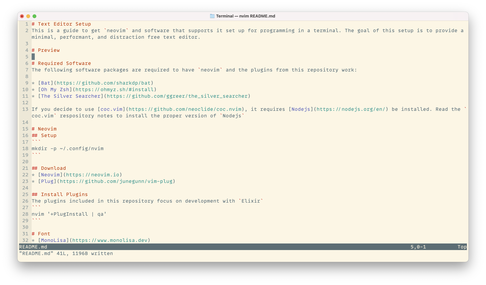
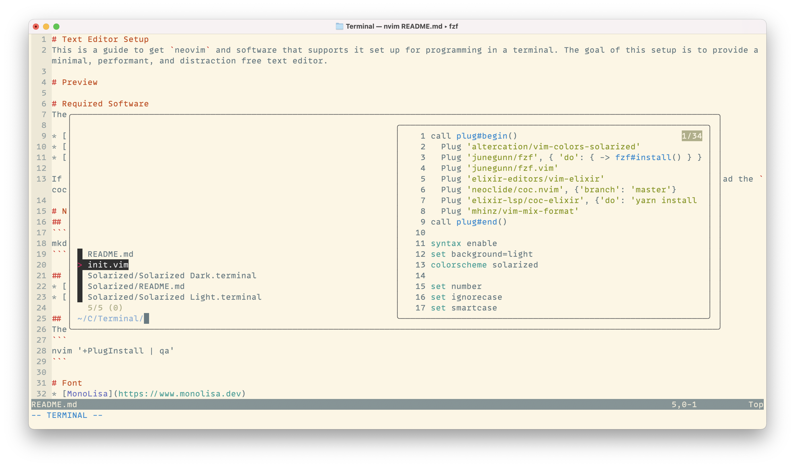

# Text Editor Setup
This is a guide to get `neovim` and software that supports it set up for programming in a terminal. The goal of this setup is to provide a minimal, performant, and distraction free text editor. 

# Preview
<table>
<tr>
  <td></td>
  <td></td>
</tr>
</table>

# Required Software
The following software packages are required to have `neovim` and the plugins from this repository work:

* [Bat](https://github.com/sharkdp/bat)
* [Oh My Zsh](https://ohmyz.sh/#install)
* [The Silver Searcher](https://github.com/ggreer/the_silver_searcher)

If you decide to use [coc.vim](https://github.com/neoclide/coc.nvim), it requires [Nodejs](https://nodejs.org/en/) be installed. Read the `coc.vim` respository notes to install the proper version of `Nodejs`

# Neovim
## Setup
```
mkdir -p ~/.config/nvim
```

## Download
* [Neovim](https://neovim.io)
* [Plug](https://github.com/junegunn/vim-plug)

## Install Plugins
The plugins included in this repository focus on development with `Elixir`
```
nvim '+PlugInstall | qa'
```

# Font
* [MonoLisa](https://www.monolisa.dev)

# Shell Options
## ~/.zshrc
```
export FZF_DEFAULT_COMMAND='ag -l --path-to-ignore ~/.ignore --hidden -g ""'
export BAT_THEME=ansi
export COLORTERM=truecolor
```
t
